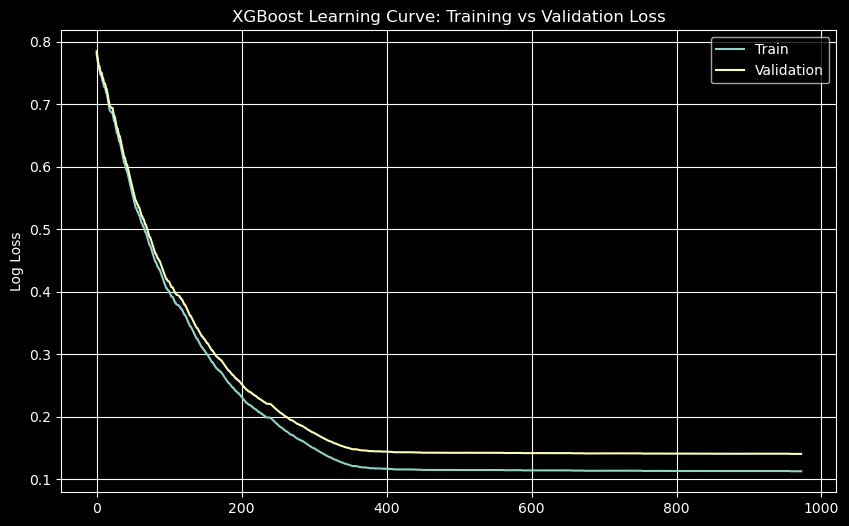
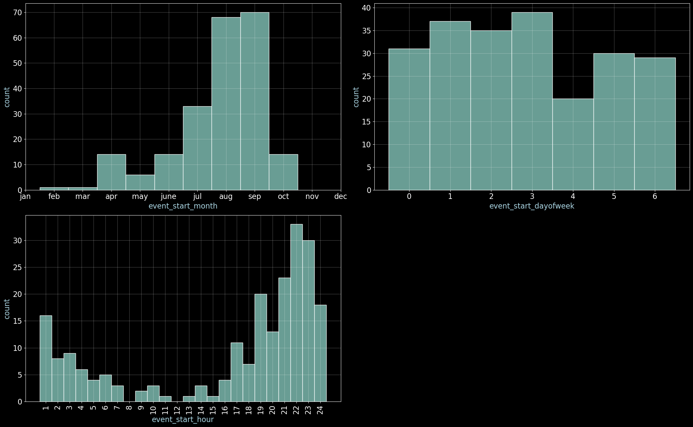
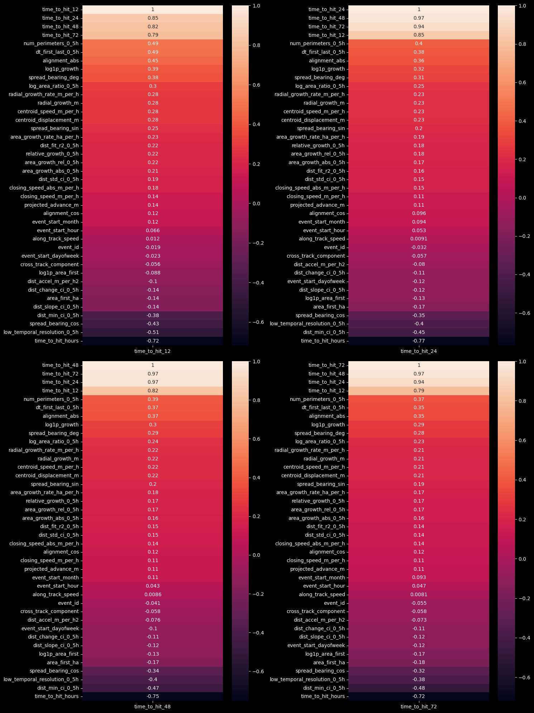
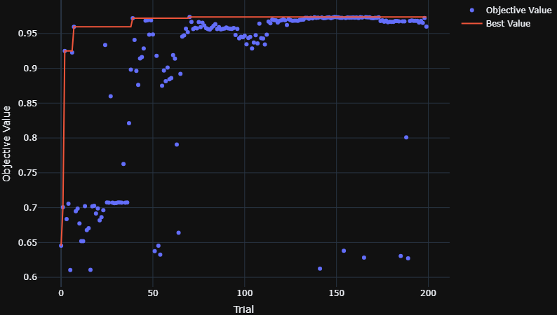
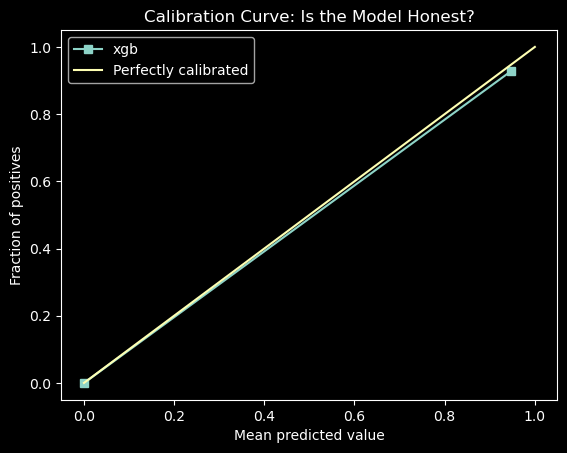

# Kaggle-Competition-ForestFire

A machine learning pipeline built for **[WiDS Global Datathon 2026](https://www.kaggle.com/competitions/WiDSWorldWide_GlobalDathon26)** on kaggle.
This repository covers exploratory data analysis (EDA), data cleaning, feature engineering, cross-validation setup, and hyperparameter tuning.

## Project Overview

* **Goal:** Predicting calibrated probability forecasts across multiple time horizons [12H,24H,36H,48H] to support real-world decisions.
* **Validation Strategy:** Stratified 5-10 Fold Cross-Validation.
* **Final Validation Score:**  
    * XGboost (Calibrated) : 0.95737  (Hybrid score)
    * LightGBM (Calibrated) : 0.95540  (Hybrid score)

## Exploratory Data Analysis & Key Insights

* **Dataset Profile:** Train Dataset [221 rows x 37]
* **Key Observations:** 
    * High correlation detected between numerical feature clusters.
    * June to September have increasing number of forest fires recorded in the given data.
    * Higher amount of forest fires have been observed from hour 16:00 - 24:00 and at 1:00 AM from the recorded data.

* **Evaluation Metric:** 
    * Primary: LogLoss,ROC-AUC,RMSE,Brier's Loss,
    * Hybrid Score : a combination of C-index and Brier's Score is taken
        `(0.3 x C-index + 0.7 x (1 - Weighted Brier Score))`

## Key Technical Highlights

* **Data Preprocessing & Scaling:** 
    * `Standard Scaler` to use the scaled data for feature selection using L1 lasso and
    * `RobustScaler` to scale the data cleanly without letting extreme outlier values shrink the rest of the features down to zero.
* **Hyperparameter Optimization:** Used `Optuna` with stratified k-fold for cross-validation to minimize logloss and maximize Hybrid score for each time horizon model.

* **Feature Selection Iterations:** Constrained feature dimensions based on feature importance ranking using both `L1 lasso` and `permutation importance` then removing the features corelated to other features to maximize generalization on small, high-dimensional validation sets. 

* **Model Calibration:** Both the XGboost and LightGBM models have been calibrated using both `Isotonic calibration` and `Sigmoid (Platt) calibration` during different instances to submit during the competition where Sigmoid performed better.

**NOTE:** All the Hyperparameters and additional info is present in the notebook itself.
